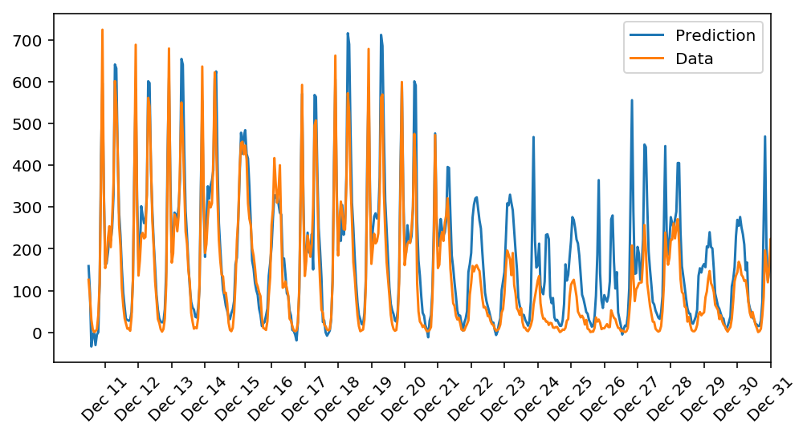

# **Project 1:** Create a neural network from scratch
## Objective
The aim of this first project is to understand how a neural networks works by creating one from scratch using only numpy. Two years of bike rentals are given as data.

## How it works
### 1. Preprocessing
The first thing to do is allways to look at the data avaiable and what we want to predict.

After data some preparation is needed:
1. Create dummy variables based on the cathegorical vars
2. Scale all features. It is done with mean normalization
3. Split data into training, test and validation.

Since we are working with timeseries the data is not randomly slplitted. The data will be splitted in 3 using (see picture):
* Last 21 days as validation
* 60 days as test data
* All remaining data for training

### 2. Neural network
The architecture used is simple. We have 59 features that will be directly be passed to a hidden layer with 16 neurons and sigmoid as an activation function. After that if will go to an ouput layer wihout activation that will give us the prediction.

The architecture is similar to the image below.

## Results
I am surprised by how well the NN predicts the bike's rentals. As we can see in the image below it is doing a good job for the firsts days (December 11 - 20) but is expecting more rentals between 21 an 31 of December.

This is normal since we only have one year of data and Christmas data were not in the training data.