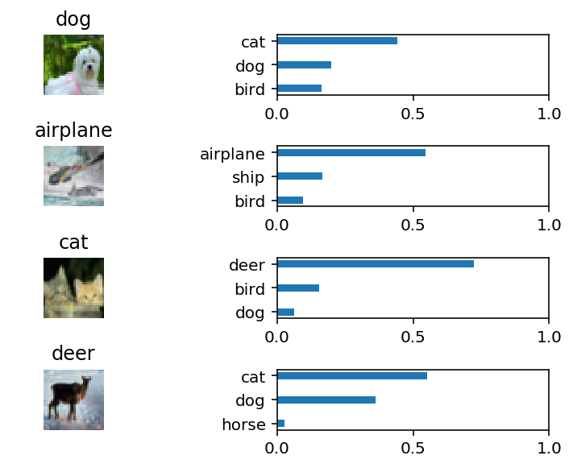

# **Project 2:** Create a neural network from scratch
## Objective
The aim of this project is to understant how Convolution Neural Networks (CNN) work. So the focus is to create one in order to classify images using CIFAR10 dataset.

## How it works
### 1. Preprocessing
In this project the preprocessing is light the only things need to do are:
* Scale pixels between 0 and 1
* One-hot encode labels

### 2. Neural network
The neural network created have 2 convolution blocks that consist of:
1. A convolution
2. A relu as activation function
3. Maxpooling for subsampling

After that it has a flattening layer followed by:
* Fully conected layer
* Another relu
* One last fully connected without activation

The architecture is similar to the image below.

## Results
Images are hard to classify for computers. The neural network ends up having around 68 % accuracy. If we take a look at some of its predictions we can see that it classify some of them correctly but it makes some mistakes.

Example of predictions:

